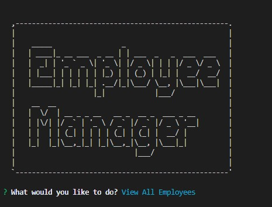

# Employee Tracker

## Description

This employee management system is an application utilizing node, inquirer and MySQL to allow companies to view, edit, and manage their employee roster and database. 

## Installation

* Navigate to https://github.com/mpkahn/employee_manager and clone repository to local machine.
* Once on local machine:
* Install npm (npm i). 
* Once NPM is installed, run "npm start" to launch application

## Usage 

See video demo: https://drive.google.com/file/d/11OtiaT97ZWeWyO3kVwUwAWk59u9i2cb2/view

* Use arrow keys to scroll amongst options
* Use enter key to enter desired menu item
* Follow prompts as directed
* Scroll down and select "quit" when finished.

## Credits

* node.js and its documentation on file systems https://nodejs.org/api/fs.html & https://nodejs.org/en/knowledge/file-system/how-to-write-files-in-nodejs/
npm js, 
* Inquirer  https://www.npmjs.com/package/inquirer/v/0.2.3
* MYSQL https://dev.mysql.com/doc/refman/8.0/en/keywords.html
* Console table to print MySQL to console https://www.npmjs.com/package/console.table

## License

MIT License

Copyright (c) [2021] [Michael Kahn]

Permission is hereby granted, free of charge, to any person obtaining a copy
of this software and associated documentation files (the "Software"), to deal
in the Software without restriction, including without limitation the rights
to use, copy, modify, merge, publish, distribute, sublicense, and/or sell
copies of the Software, and to permit persons to whom the Software is
furnished to do so, subject to the following conditions:

The above copyright notice and this permission notice shall be included in all
copies or substantial portions of the Software.

THE SOFTWARE IS PROVIDED "AS IS", WITHOUT WARRANTY OF ANY KIND, EXPRESS OR
IMPLIED, INCLUDING BUT NOT LIMITED TO THE WARRANTIES OF MERCHANTABILITY,
FITNESS FOR A PARTICULAR PURPOSE AND NONINFRINGEMENT. IN NO EVENT SHALL THE
AUTHORS OR COPYRIGHT HOLDERS BE LIABLE FOR ANY CLAIM, DAMAGES OR OTHER
LIABILITY, WHETHER IN AN ACTION OF CONTRACT, TORT OR OTHERWISE, ARISING FROM,
OUT OF OR IN CONNECTION WITH THE SOFTWARE OR THE USE OR OTHER DEALINGS IN THE
SOFTWARE.